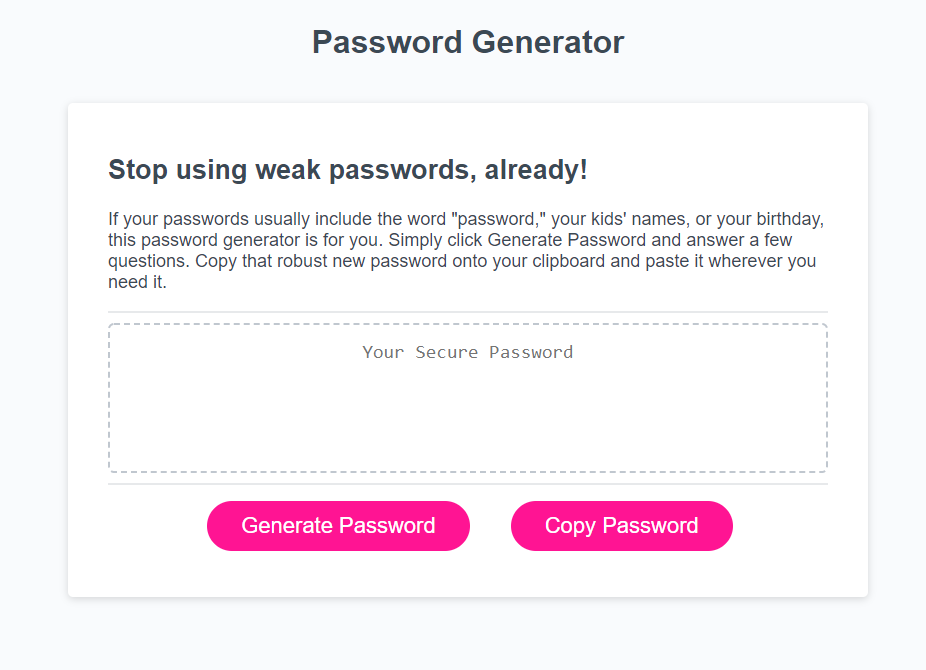

# Random Password Generator

## Description

For this project, I created a random password generator that allows a user to decide characteristics of the password. First, the user will click the Generate Password button. They will next decide how long the password will be. Then, they can choose to include special characters, lower and uppercase letters, and/or numbers. Once the password is generated, the user can use the Copy Password button to copy it to their clipboard.

## Usage

This random password generator is intended to create stronger passwords by stringing together random characters rather than relying on personal information. Some sites require passwords longer than 8 characters, so users will have to pick an appropriate number. Although the random passwords generated by this site will be suitable for most instances, they may not be acceptable where cryptographically secure random passwords are required.

## Credits

Thank you to my boot camp instructor, Joe Tanksley, and TA, Adam Abundis, as well as my cohort. Thanks to Thor Nolan, my tutor, who helped me work through the JavaScript concepts that went into this project.

As usual, I found a lot of great resources from W3 Schools and Codecademy. I will also post a few links for other resources I found useful.

<https://youtu.be/9sT03jEwcaw>

<https://webdevtrick.com/javascript-random-password-generator/>

## License

I chose a permissive GNU license for this project, so that others can use and modify the code for their own purposes, but the source code cannot become proprietary and changes must be documented. The file name is COPYING as per GNU convention.## License.
